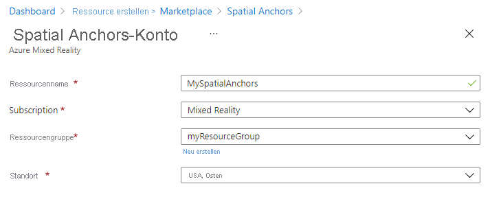
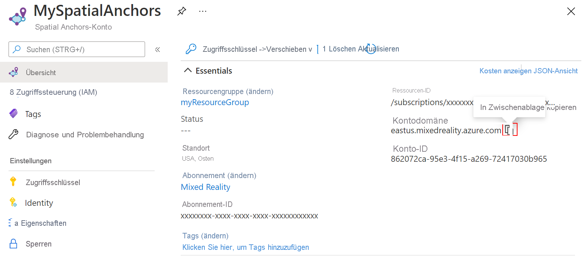

## Erstellen einer Spatial Anchors-Ressource

Öffnen Sie das <a href="https://portal.azure.com" target="_blank">Azure-Portal</a>.

Wählen Sie im linken Bereich **Ressource erstellen** aus.

Suchen Sie über das Suchfeld nach **Spatial Anchors**.

Wählen Sie **Spatial Anchors** und dann **Erstellen** aus.

Führen Sie im Bereich **Spatial Anchors-Konto** die folgenden Schritte aus:

* Geben Sie einen eindeutigen Ressourcennamen in regulären alphanumerischen Zeichen ein.  
* Wählen Sie das Abonnement aus, an das die Ressource angefügt werden soll.  
* Erstellen Sie eine Ressourcengruppe durch Auswählen von **Neu erstellen**. Nennen Sie sie **myResourceGroup**, und wählen Sie **OK** aus.  

  [!INCLUDE [resource group intro text](resource-group.md)]
  
* Wählen Sie einen Standort (Region) für die Ressource aus.  
* Wählen Sie **Neu** aus, um mit der Ressourcenerstellung zu beginnen.

Nachdem die Ressource erstellt wurde, zeigt das Azure-Portal an, dass die Bereitstellung abgeschlossen ist. 
   

Wählen Sie **Zu Ressource wechseln** aus. Nun können Sie die Ressourceneigenschaften anzeigen. 
   
Kopieren Sie den Wert für **Konto-ID** der Ressource zur späteren Verwendung in einen Text-Editor.

Kopieren Sie außerdem den Wert für **Kontodomäne** der Ressource zur späteren Verwendung in einen Text-Editor.

Wählen Sie unter **Einstellungen** die Option **Schlüssel** aus. Kopieren Sie die Werte für **Primärschlüssel** und **Kontoschlüssel** zur späteren Verwendung in einen Text-Editor.

