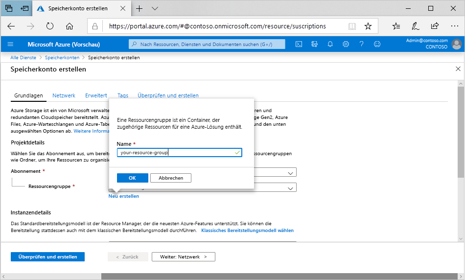

Führen Sie diese Schritte aus, wenn Sie ein allgemeines Speicherkonto vom Typ „General Purpose v2“ über das Azure-Portal erstellen möchten:

1. Wählen Sie im Menü des Azure-Portals **Alle Dienste** aus. Geben Sie in der Liste mit den Ressourcen **Speicherkonten** ein. Sobald Sie mit der Eingabe beginnen, wird die Liste auf der Grundlage Ihrer Eingabe gefiltert. Wählen Sie **Speicherkonten**.
2. Klicken Sie im angezeigten Fenster **Speicherkonten** auf **Hinzufügen**.
3. Wählen Sie das Abonnement aus, in dem das Speicherkonto erstellt werden soll.
4. Wählen Sie unter dem Feld **Ressourcengruppe** die Option **Neu erstellen**. Geben Sie einen Namen für die neue Ressourcengruppe an, wie in der folgenden Abbildung dargestellt.

    

5. Geben Sie als Nächstes einen Namen für Ihr Speicherkonto ein. Der gewählte Name muss innerhalb von Azure eindeutig sein. Der Name muss ebenfalls zwischen 3 und 24 Zeichen lang sein und darf nur Zahlen und Kleinbuchstaben enthalten.
6. Wählen Sie einen Standort für Ihr Speicherkonto aus, oder verwenden Sie den Standardstandort.
7. Behalten Sie die Standardwerte für diese Felder bei:

   |Feld  |value  |
   |---------|---------|
   |Bereitstellungsmodell     |Ressourcen-Manager         |
   |Leistung     |Standard         |
   |Kontoart     |StorageV2 (universell v2)         |
   |Replikation     |Georedundanter Speicher mit Lesezugriff (RA-GRS)         |
   |Zugriffsebene     |Heiß         |

8. Wenn Sie [Azure Data Lake Storage](https://azure.microsoft.com/services/storage/data-lake-storage/) verwenden möchten, wählen Sie die Registerkarte **Erweitert** aus, und legen Sie **Hierarchischer Namespace** auf **Aktiviert** fest.
9. Wählen Sie **Überprüfen + erstellen**, um die Speicherkontoeinstellungen zu überprüfen und das Konto zu erstellen.
10. Klicken Sie auf **Erstellen**.

Weitere Informationen zu den Arten von Speicherkonten und anderen Speicherkontoeinstellungen finden Sie unter [Übersicht über Azure Storage-Konten](https://docs.microsoft.com/azure/storage/common/storage-account-overview). Weitere Informationen zu Ressourcengruppen finden Sie unter [Übersicht über den Azure Resource Manager](https://docs.microsoft.com/azure/azure-resource-manager/resource-group-overview). 
