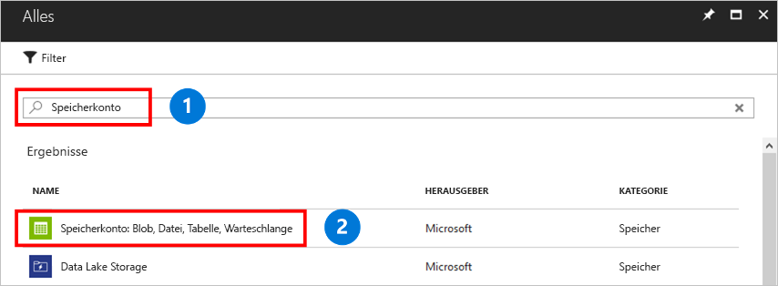

Ein Speicherkonto ist ein gemeinsam genutzter Pool mit Speicherplatz, in dem Sie eine Azure-Dateifreigabe oder andere Speicherressourcen wie Blobs oder Warteschlangen bereitstellen können. Ein Speicherkonto kann eine unbegrenzte Anzahl von Freigaben enthalten. Auf einer Freigabe kann eine unbegrenzte Anzahl von Dateien gespeichert werden, bis die Kapazitätsgrenzen des Speicherkontos erreicht sind.

So erstellen Sie ein Speicherkonto:

1. Klicken Sie im Menü auf der linken Seite auf **+** , um eine Ressource zu erstellen.
1. Geben Sie im Suchfeld den Suchbegriff **Speicherkonto** ein, klicken Sie auf **Speicherkonto – Blob, Datei, Tabelle, Warteschlange**, und klicken Sie anschließend auf **Erstellen**.
    

1. Geben Sie unter **Name** den Namen *mystorageacct* sowie einige zufällig gewählte Zahlen ein, bis durch ein grünes Häkchen signalisiert wird, dass der Name eindeutig ist. Der Name des Speicherkontos darf nur Kleinbuchstaben enthalten und muss global eindeutig sein. Notieren Sie sich den Speicherkontonamen. Er wird später noch benötigt. 
1. Übernehmen Sie unter **Bereitstellungsmodell** den Standardwert **Resource Manager**. Weitere Informationen zu den Unterschieden zwischen der Azure Resource Manager-Bereitstellung und dem klassischen Bereitstellungsmodell finden Sie unter [Grundlegendes zu Bereitstellungsmodellen und zum Status von Ressourcen](../articles/azure-resource-manager/management/deployment-models.md).
1. Übernehmen Sie unter **Leistung** den Standardwert **Standard**.
    
    > [!NOTE]
    > Dieser Schnellstart erstellt eine Standarddateifreigabe, aber wenn Sie Premium-Dateifreigaben verwenden möchten, wählen Sie stattdessen **Premium** aus.

1. Wählen Sie unter **Kontoart** die Option **StorageV2**. Weitere Informationen zu den unterschiedlichen Arten von Speicherkonten finden Sie unter [Optionen für Azure Storage-Konten](../articles/storage/common/storage-account-overview.md?toc=%2fazure%2fstorage%2ffiles%2ftoc.json).

    > [!NOTE]
    > In diesem Schnellstart wird ein Konto vom Typ „Allgemein v2 (GPv2)“ erstellt. Wenn Sie Premium-Dateifreigaben verwenden möchten, wählen Sie stattdessen **FileStorage** aus.

1. Wählen Sie unter **Replikation** die Option **Lokal redundanter Speicher (LRS)** aus. 
1. Es empfiehlt sich, unter **Sichere Übertragung erforderlich** immer die Option **Aktiviert** auszuwählen. Weitere Informationen zu dieser Option finden Sie unter [Vorschreiben einer sicheren Übertragung in Azure Storage](../articles/storage/common/storage-require-secure-transfer.md?toc=%2fazure%2fstorage%2ffiles%2ftoc.json).
1. Wählen Sie unter **Abonnement** das Abonnement aus, mit dem das Speicherkonto erstellt wurde. Falls Sie nur über ein einzelnes Abonnement verfügen, sollte es das Standardabonnement sein.
1. Wählen Sie unter **Ressourcengruppe** die Option **Neu erstellen** aus. Geben Sie als Name *myResourceGroup* ein.
1. Wählen Sie unter **Standort** die Option **USA, Osten**.
1. Übernehmen Sie unter **Virtuelle Netzwerke** die Standardoption **Deaktiviert**. 
1. Aktivieren Sie das Kontrollkästchen **An Dashboard anheften**, um das Speicherkonto leichter zu finden.
1. Klicken Sie abschließend auf **Erstellen**, um die Bereitstellung zu starten.