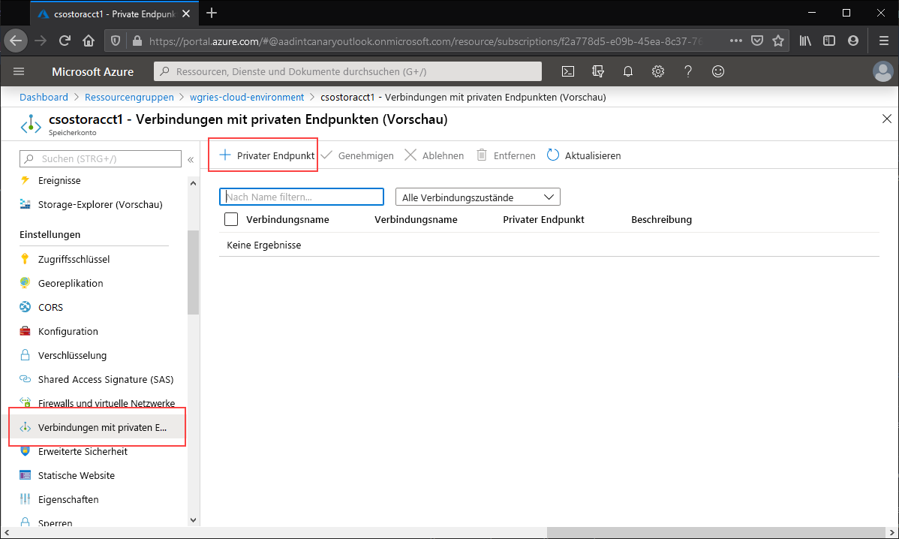
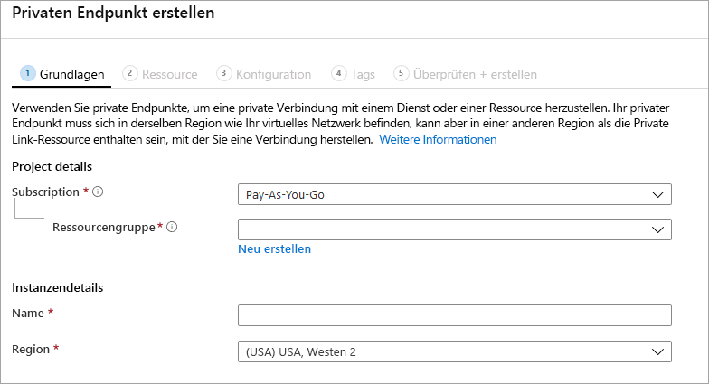
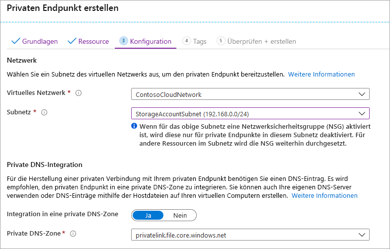

Navigieren Sie zu dem Speicherkonto, für das Sie einen privaten Endpunkt erstellen möchten. Wählen Sie im Inhaltsverzeichnis für das Speicherkonto die Option **Private Endpunktverbindungen** und dann **+ Privater Endpunkt** aus, um einen neuen privaten Endpunkt zu erstellen. 

Im anschließend angezeigten Assistenten müssen mehrere Seiten ausgefüllt werden.

Wählen Sie auf dem Blatt **Grundlagen** die gewünschte Ressourcengruppe, den Namen und die Region für Ihren privaten Endpunkt aus. Diese können beliebig sein und müssen nicht mit dem Speicherkonto übereinstimmen. Allerdings müssen Sie den privaten Endpunkt in derselben Region erstellen wie das virtuelle Netzwerk, in dem Sie den privaten Endpunkt erstellen möchten.

Wählen Sie auf dem Blatt **Ressourcen** das Optionsfeld für **Verbindung mit einer Azure-Ressource im eigenen Verzeichnis herstellen** aus. Wählen Sie als **Ressourcentyp** **Microsoft.Storage/storageAccounts** aus. Das Feld **Ressourcen** ist das Speicherkonto mit der Azure-Dateifreigabe, mit der Sie eine Verbindung herstellen möchten. Die untergeordnete Zielressource ist **file**, da es sich hier um Azure Files handelt.

Auf dem Blatt **Konfiguration** können Sie das spezifische virtuelle Netzwerk und das Subnetz auswählen, dem Sie Ihren privaten Endpunkt hinzufügen möchten. Sie müssen ein anderes Subnetz als das Subnetz auswählen, zu dem Sie oben Ihren Dienstendpunkt hinzugefügt haben. Das Blatt „Konfiguration“ enthält auch die Informationen zum Erstellen bzw. Aktualisieren der privaten DNS-Zone. Wir empfehlen Ihnen die Verwendung der Standardzone `privatelink.file.core.windows.net`.

Klicken Sie auf **Überprüfen + Erstellen**, um den privaten Endpunkt zu erstellen. 
