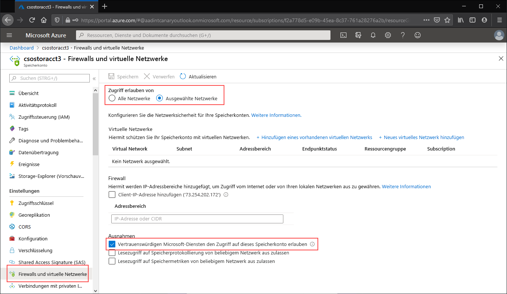

Navigieren Sie zu dem Speicherkonto, für das Sie den gesamten Zugriff auf den öffentlichen Endpunkt einschränken möchten. Wählen Sie im Inhaltsverzeichnis des Speicherkontos den Eintrag **Firewalls und virtuelle Netzwerke** aus.

Wählen Sie oben auf der Seite das Optionsfeld **Ausgewählte Netzwerke** aus. Hierdurch werden einige Einstellungen zum Steuern der Einschränkung des öffentlichen Endpunkts eingeblendet. Aktivieren Sie **Vertrauenswürdigen Microsoft-Diensten den Zugriff auf dieses Speicherkonto erlauben**, um für vertrauenswürdige Microsoft-Erstanbieterdienste, z. B. die Azure-Dateisynchronisierung, den Zugriff auf das Speicherkonto zuzulassen.

