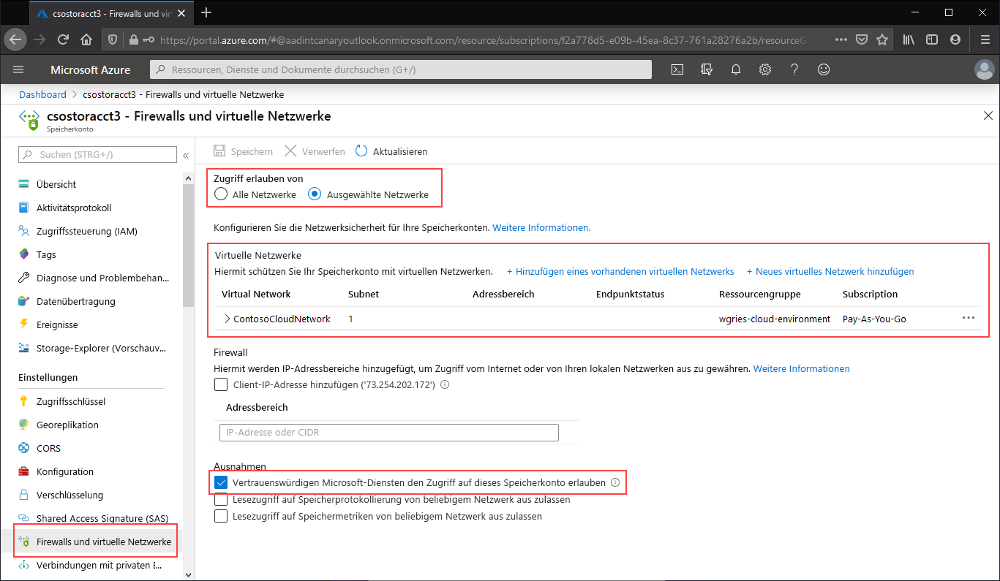

Navigieren Sie zu dem Speicherkonto, für das Sie den öffentlichen Endpunkt auf bestimmte virtuelle Netzwerke einschränken möchten. Wählen Sie im Inhaltsverzeichnis des Speicherkontos den Eintrag **Firewalls und virtuelle Netzwerke** aus. 

Wählen Sie oben auf der Seite das Optionsfeld **Ausgewählte Netzwerke** aus. Hierdurch werden einige Einstellungen zum Steuern der Einschränkung des öffentlichen Endpunkts eingeblendet. Klicken Sie auf **+ Vorhandenes virtuelles Netzwerk hinzufügen**, um das jeweilige virtuelle Netzwerk auszuwählen, für das der Zugriff auf das Speicherkonto über den öffentlichen Endpunkt zulässig sein soll. Hierfür müssen ein virtuelles Netzwerk und ein zugehöriges Subnetz ausgewählt werden. 

Aktivieren Sie **Vertrauenswürdigen Microsoft-Diensten den Zugriff auf dieses Speicherkonto erlauben**, um für vertrauenswürdige Microsoft-Erstanbieterdienste, z. B. die Azure-Dateisynchronisierung, den Zugriff auf das Speicherkonto zuzulassen.

