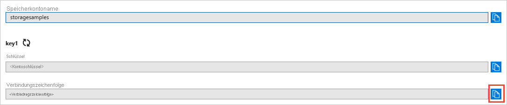

### <a name="copy-your-credentials-from-the-azure-portal"></a>Kopieren Ihrer Anmeldeinformationen aus dem Azure-Portal

Wenn die Beispielanwendung eine Anforderung an Azure Storage sendet, muss diese autorisiert werden. Fügen Sie zum Autorisieren einer Anforderung die Anmeldeinformationen für Ihr Speicherkonto in Form einer Verbindungszeichenfolge hinzu. Führen Sie zum Anzeigen der Anmeldeinformationen Ihres Speicherkontos die folgenden Schritte aus:

1. Melden Sie sich beim [Azure-Portal](https://portal.azure.com) an.
2. Suchen Sie nach Ihrem Speicherkonto.
3. Wählen Sie im Abschnitt **Einstellungen** der Speicherkontoübersicht die Option **Zugriffsschlüssel**. Hier können Sie Ihre Kontozugriffsschlüssel und die vollständige Verbindungszeichenfolge für jeden Schlüssel anzeigen.
4. Suchen Sie unter **key1** nach dem Wert für die **Verbindungszeichenfolge**, und wählen Sie dann die Schaltfläche **Kopieren**, um die Verbindungszeichenfolge zu kopieren. Der Wert der Verbindungszeichenfolge wird in einem späteren Schritt einer Umgebungsvariablen hinzugefügt.

    

### <a name="configure-your-storage-connection-string"></a>Konfigurieren der Speicherverbindungszeichenfolge

Wenn Sie die Verbindungszeichenfolge kopiert haben, legen Sie sie in der Datei *MainPage.xaml.cs* auf eine Variable auf Klassenebene fest. Öffnen Sie *MainPaage.xaml.cs*, und suchen Sie die Variable `storageConnectionString`. Ersetzen Sie `<yourconnectionstring>` durch Ihre Verbindungszeichenfolge.

Der Code lautet wie folgt:

```csharp
string storageConnectionString = "<yourconnectionstring>";
```